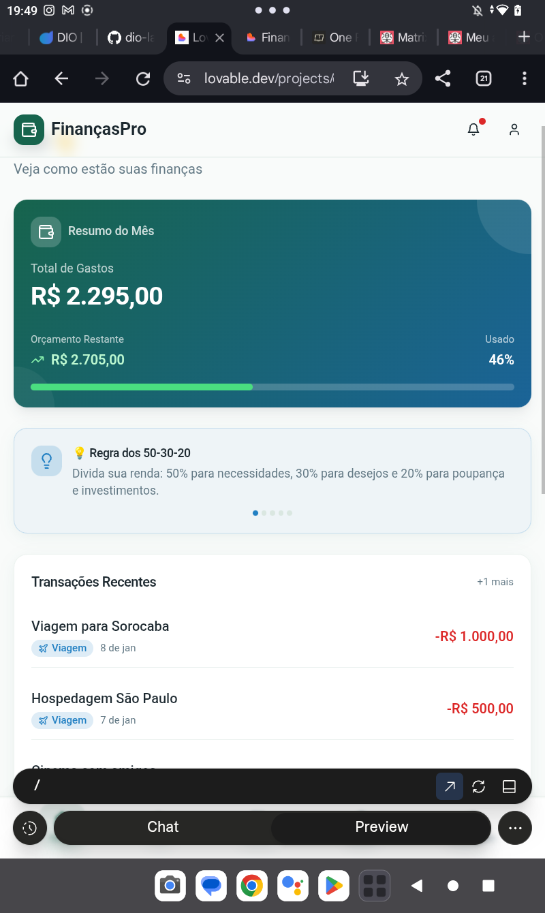

# 📊 FinançasPro — Resumo Financeiro do Mês

## Resumo do Mês
- **Total de Gastos:** R$ 2.295,00  
- **Orçamento Restante:** R$ 2.705,00  
- **Usado:** 46%

---

## 💡 Regra dos 50-30-20
> Divida sua renda:  
> - **50%** para necessidades  
> - **30%** para desejos  
> - **20%** para poupança e investimentos

---

## 🧾 Transações Recentes

| Data       | Descrição                  | Valor        |
|------------|----------------------------|--------------|
| 08 Jan     | Viagem para Sorocaba       | -R$ 1.000,00 |
| 07 Jan     | Hospedagem São Paulo       | -R$ 500,00   |

---

## 📷 Visual do App

---

📱 *Gerenciado com FinançasPro*
